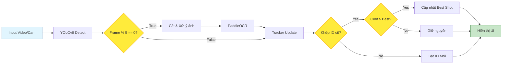

```mermaid
    graph LR;
    Input[Input Video/Cam] --> Detector[YOLOv8 Detect]
    Detector --> CheckOCR{Frame % 5 == 0?}
    
    %% Nhánh chạy OCR
    CheckOCR -- True --> Preprocess[Cắt & Xử lý ảnh]
    Preprocess --> OCR[PaddleOCR]
    OCR --> Tracker[Tracker Update]
    
    %% Nhánh bỏ qua OCR
    CheckOCR -- False --> Tracker
    
    %% Logic Tracker
    Tracker --> Match{Khớp ID cũ?}
    Match -- Yes --> Compare{Conf > Best?}
    Compare -- Yes --> Update[Cập nhật Best Shot]
    Compare -- No --> Keep[Giữ nguyên]
    Match -- No --> NewID[Tạo ID Mới]
    
    %% Gom về UI
    Update --> UI[Hiển thị UI]
    Keep --> UI
    NewID --> UI
    
    %% Styling (Tùy chọn cho đẹp)
    style CheckOCR fill:#ffeb3b,stroke:#fbc02d,stroke-width:2px
    style Match fill:#ffeb3b,stroke:#fbc02d,stroke-width:2px
    style Compare fill:#ffeb3b,stroke:#fbc02d,stroke-width:2px
    style Input fill:#e1f5fe,stroke:#01579b
    style UI fill:#c8e6c9,stroke:#2e7d32
```